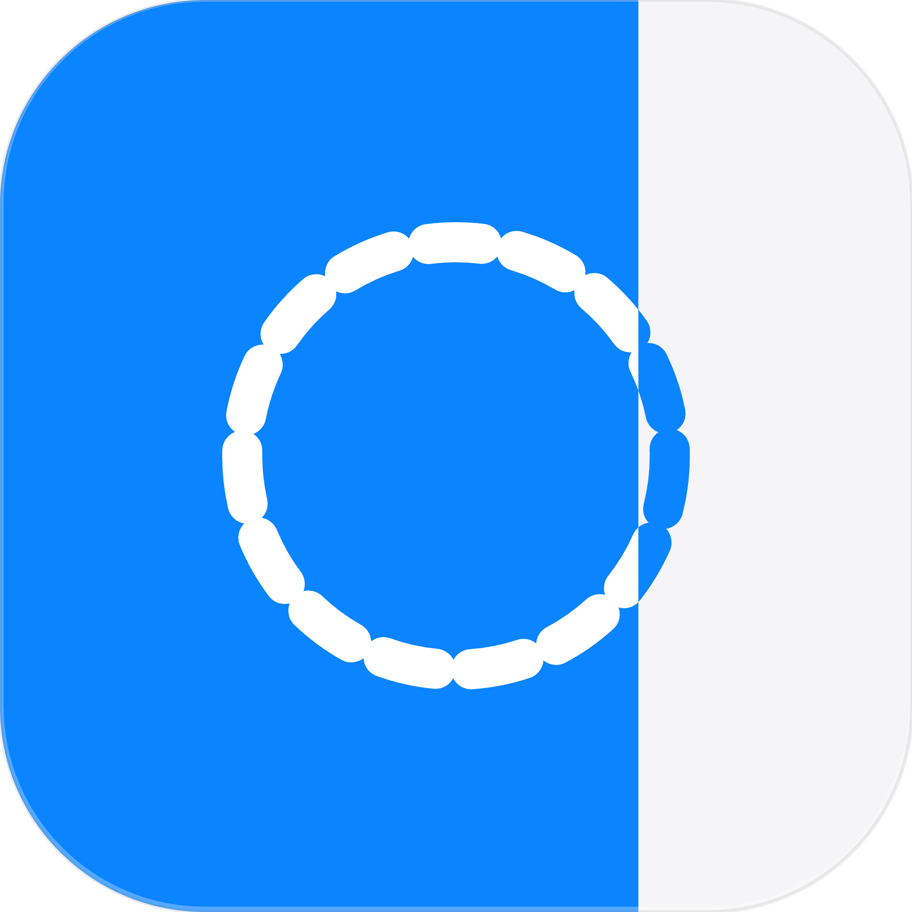

# Pomodoro
Pomodoro App for Mac (Menu Bar App)

# Pomodoro

A minimalist Pomodoro timer that lives exclusively in your macOS Menu Bar. Built with SwiftUI.

  

Pomodoro Bar gets out of your way. There is no Dock icon, no floating windows, and no unnecessary clicks. It uses fluid hover gestures, native Liquid Glass, and a dynamic menu bar icon that fills up as your timer progresses.

## Features

- **Menu Bar Only:** Operates entirely as a background agent. It won't clutter your Dock.
- **Liquid Glass:** Beautiful, translucent design with native Liquid Glass design that react to your chosen accent color.
- **Progressive Native Alarms:** Uses native Apple system sounds that start at a whisper and gradually increase, preserving your flow state.

## Installation (Important)

Since this app is open-source and not distributed through the Mac App Store, macOS Gatekeeper requires a specific step the first time you open it.

1. Go to the [Releases](https://github.com/emilianooowo/Pomodoro/releases) page and download the latest `Pomodoro.zip`.
2. Unzip the file and drag `Pomodoro.app` to your **Applications** folder.
3. **First Launch Only:** Right-click (or Control-click) on the `Pomodoro.app` and select **Open**. 
4. macOS will show a warning asking if you are sure you want to open it. Click **Open**. 
*(After doing this once, you can open the app normally forever).*

## Settings & Customization

Click the gear icon `⚙` in the app to open the native Settings window:
- **Accent Color:** Choose the primary color using the native macOS color picker.
- **Menu Bar Icon:** Choose between a timer, clock, hourglass, alarm, or dashed circle.
- **Quick Presets:** Edit the default minute values for the 4 quick-start buttons.
- **Sounds:** Hover over any sound name to hear a quick preview.

## Development

Built with by [Emiliano Leal].

- **Framework:** SwiftUI & AppKit
- **Architecture:** `LSUIElement` (Agent App) + `NSPopover`
- **Requirements:** macOS 14.0+ (Optimized for modern macOS)

Feel free to report issues!

## License

This project is licensed under the MIT License - see the [LICENSE](LICENSE) file for details.
